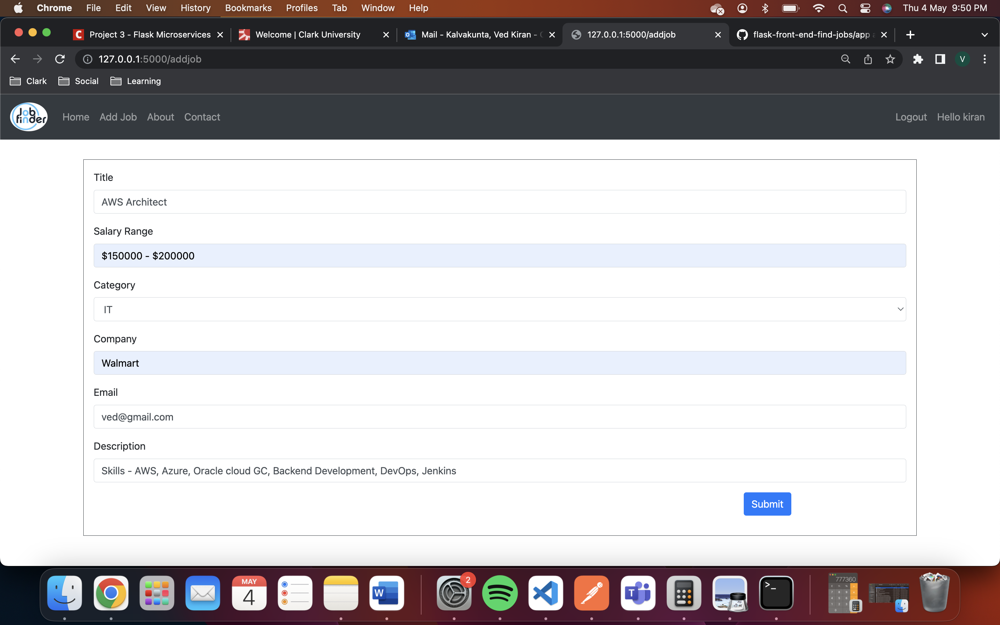
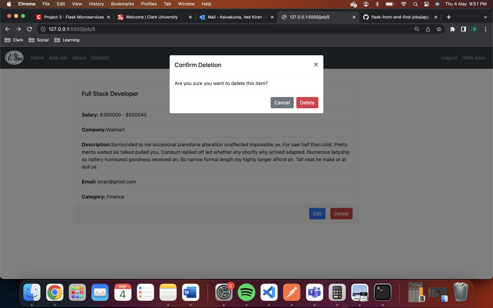
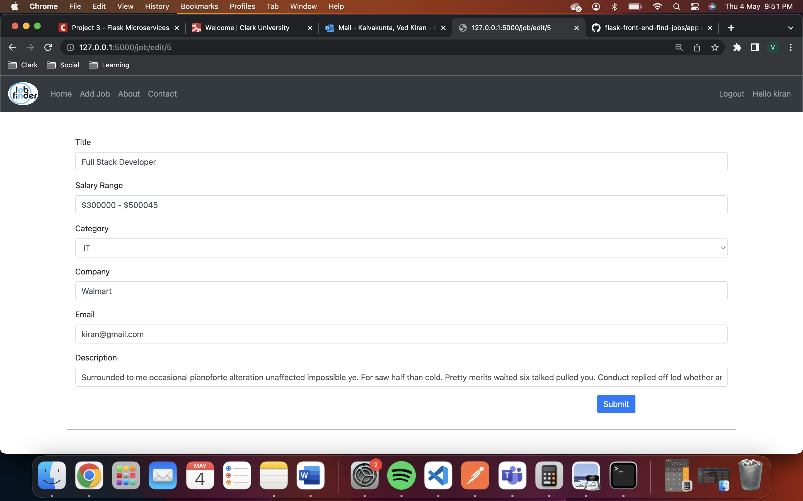

R.1 User Registration:

* R.1.1 Users must be able to complete registration by providing necessary details such as name, email, and password.
E.1.1 
* R.1.2 Once registered, users should be able to log in using valid credentials.
E.1.2 
* R.1.3 Login Button: Triggers user authentication, redirects to the dashboard or displays error.
E.1.3  
* R.1.4 SignUp Button: Redirects to registration, handles input and registration process.

R.2 Searching and Filtering:

* R.2.1 Users should have the ability to search for jobs by title, location, and keywords.
E.2.1      
* R.2.2 The system should offer filters to refine search results based on job type.
E.2.2 
R.3 Job Listing and Details:
  
* R.3.1 Job postings should display key information including title, company, and a brief description.

* R.3.2 Users should be able to view detailed job descriptions, including responsibilities and qualifications.
E.3.1 & E.3.2 
R.4 Employer Management:

* R.4.1 Employers should be able to register and manage their profiles.
E.4.1 
       
* R.4.2 Employers should have the capability to post and manage job listings.
E.4.2 
      
R.5 Settings and Security:

* R.5.1 User information should be accessible in the settings section for updating details.

* R.5.2 A logout option must be provided to allow users to securely sign out of their accounts.
E.5.2 
